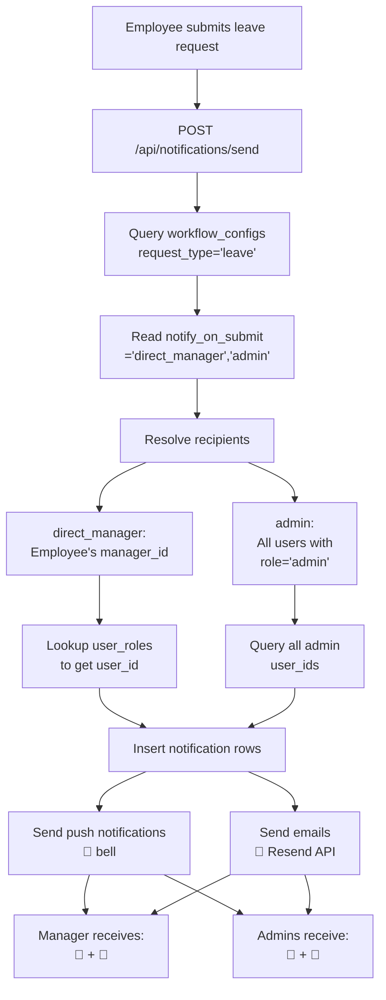

# 🔔 Leave Request Notification System - Complete Solution

## 🎯 Quick Overview

**The Problem:** Mr. Ralf Dugan filed a vacation leave request, but admin users did NOT receive notifications (neither system bell 🔔 nor email 📧).

**The Root Cause:** The `workflow_configs` database table is configured with:
- `request_type = 'leave'`
- `notify_on_submit = ["direct_manager"]` ← **ONLY manager, no admin!**

**The Solution:** Update the configuration to include both:
- `notify_on_submit = ["direct_manager", "admin"]` ← **NOW INCLUDES BOTH!**

**Where to Apply:** Admin UI at `/admin/system-config/workflow-settings`

**Time to Fix:** 5 minutes

---

## 🚀 Apply the Fix in 3 Steps

### Step 1: Access Workflow Settings
```
Admin → System Configuration → Workflow Settings
```

### Step 2: Configure Leave Request
Find the **"Leave Request"** card and ensure:
- ✅ "Notify on Request Submit" → Check **both:**
  - ✅ Direct Manager
  - ✅ All Admin-role Users
- ✅ "Notify on Decision" → Check:
  - ✅ All Admin-role Users

### Step 3: Save & Test
- Click **"Save"** button
- Should show: ✅ "Workflow configuration saved successfully"
- Test by submitting a new leave request
- Verify both manager and admin receive notifications

---

## ✅ After the Fix

When any employee submits a leave request:

```
Employee submits leave → System triggers notification → API reads config
                                                              ↓
                            Resolves two groups of recipients:
                            ├─ "direct_manager" → Employee's supervisor
                            └─ "admin" → ALL admin-role users
                                    ↓
                    Both groups receive BOTH notifications:
                    ├─ 🔔 System notification bell
                    └─ 📧 Email with leave details
```

---

## 📋 Documentation Files

All documentation is in the repository:

| File | Purpose | Read Time |
|------|---------|-----------|
| **FIX_LEAVE_NOTIFICATIONS_QUICK.md** | ⭐ Quick 5-minute fix guide | 5 min |
| **IMPLEMENTATION_SUMMARY.md** | Overview & implementation checklist | 10 min |
| **LEAVE_NOTIFICATIONS_SETUP.md** | Detailed step-by-step with troubleshooting | 20 min |
| **LEAVE_NOTIFICATIONS_ARCHITECTURE.md** | Complete system design & code flow | 30 min |
| **BEFORE_AND_AFTER_VISUAL.md** | Visual diagrams of the flow | 15 min |
| **LEAVE_NOTIFICATION_FIX.md** | Technical deep dive | 20 min |

**→ START WITH:** `FIX_LEAVE_NOTIFICATIONS_QUICK.md`

---

## 🗂️ Supporting Files

**Database Migration:**
```
supabase/fix-leave-notification-config.sql
```
Run in Supabase SQL Editor if you prefer SQL over UI

**Verification Scripts:**
```
scripts/verify-leave-notifications.js
scripts/setup-leave-notifications.js
```

---

## 🎛️ How It Works (System Architecture)

### The Complete Flow



### Key Points

1. **Database-Driven:** All config in `workflow_configs` table, NOT hardcoded
2. **UI-Configurable:** Changes via Admin UI, no code deployment needed
3. **Immediate Effect:** Changes take effect for next request
4. **Consistent Pattern:** Same system for ALL request types
5. **Extensible:** Add new role slugs without code changes

---

## 🧪 Verification

### Check 1: Configuration
```bash
# Run verification script
node scripts/verify-leave-notifications.js
```

Should output: ✅ All checks passed

### Check 2: Database Query
```sql
SELECT 
  request_type,
  notify_on_submit,
  notify_on_decision,
  is_active
FROM workflow_configs
WHERE request_type = 'leave';
```

Should show: `["direct_manager", "admin"]` ✅

### Check 3: Test Submission
1. Log in as employee
2. Submit new leave request
3. Check notifications:
   - Manager should receive 🔔 + 📧
   - All admins should receive 🔔 + 📧

---

## 🔧 Troubleshooting

### No notifications appear?
1. ✅ Verify workflow_configs is active: `is_active = true`
2. ✅ Check admin users exist: `SELECT * FROM user_roles WHERE role='admin'`
3. ✅ Verify RESEND_API_KEY in `.env.local`
4. ✅ Look for `[notifications/send]` errors in server logs

### Only manager notified, not admin?
- Check: `notify_on_submit` includes `"admin"`
- Via UI: Verify "All Admin-role Users" is ✅ checked

### No email arriving?
- Check RESEND_API_KEY is set and valid in `.env.local`
- Verify admin employees have email addresses

### Employee has no manager?
- Set `manager_id` in employees table for that employee

---

## 💡 Why This Design?

### Traditional Approach (Hardcoded)
```javascript
// Old way - hardcoded in code
if (requestType === 'leave') {
  notifyUserIds = [managerId]  // Only manager!
  // To add admin, must modify code → redeploy
}
```

### New Approach (Database-Driven)
```sql
-- New way - in database, UI-editable
SELECT notify_on_submit 
FROM workflow_configs 
WHERE request_type='leave'
-- Returns: ["direct_manager", "admin"]
-- To change, just update this array in UI - instant!
```

**Benefits:**
- ✅ No code changes needed
- ✅ Changes take effect immediately
- ✅ Works for ALL request types
- ✅ Easy to understand and maintain
- ✅ Completely extensible

---

## 🎓 How This Applies to Other Request Types

The same notification system manages:

| Request Type | Recipients | Config Location |
|---|---|---|
| **Leave** | Manager + Admin | Workflow Settings → Leave Request |
| **Travel** | ED + Admin + Finance | Workflow Settings → Travel Request |
| **Equipment** | Admin Dept Manager | Workflow Settings → Office Equipment Request |
| **Supply** | Admin Dept Manager | Workflow Settings → Office Supply Request |
| **Publication** | Admin Dept Manager | Workflow Settings → Publication Request |
| **Leave Credit** | ED + Admin | Workflow Settings → Leave Credit Request |

All follow the same pattern:
1. Configuration in `workflow_configs`
2. Editable via Admin UI
3. Role resolution and notification sending is automatic

---

## 📊 System Components

### Database Layer
- **Table:** `workflow_configs`
  - Stores configuration for each request type
  - Admin-editable via the UI

### API Layer
- **Route:** `src/app/api/notifications/send/route.ts`
  - Reads configuration
  - Resolves role slugs to user IDs
  - Inserts notifications
  - Sends push + emails

### UI Layer
- **Page:** `src/app/(dashboard)/admin/system-config/workflow-settings/page.tsx`
  - Admin interface for managing configurations
  - Checkboxes for each role slug
  - Save/cancel buttons

### Service Layer
- **File:** `src/services/leaveRequest.service.ts`
  - Triggers notification API when request is created
- **File:** `src/services/requestNotification.helper.ts`
  - Helper to call notification API

---

## ✨ Next Steps

1. **Read:** [FIX_LEAVE_NOTIFICATIONS_QUICK.md](./FIX_LEAVE_NOTIFICATIONS_QUICK.md) (5 min)
2. **Apply:** Follow steps 1-3 above (5 min)
3. **Test:** Submit a test leave request (5 min)
4. **Verify:** Check both manager and admin received notifications
5. **Document:** Note any custom configurations

---

## 📞 Need Help?

- **Quick reference:** See FIX_LEAVE_NOTIFICATIONS_QUICK.md
- **Detailed steps:** See LEAVE_NOTIFICATIONS_SETUP.md
- **System understanding:** See LEAVE_NOTIFICATIONS_ARCHITECTURE.md
- **Troubleshooting:** See IMPLEMENTATION_SUMMARY.md

---

## ✅ Summary

| Aspect | Details |
|--------|---------|
| **Issue** | Admin users not notified of leave requests |
| **Cause** | `notify_on_submit` array missing "admin" |
| **Fix** | Add "admin" to the array via Admin UI |
| **Where** | `/admin/system-config/workflow-settings` |
| **Time** | 5 minutes to apply, 5 minutes to test |
| **Scope** | All leave requests, all request types |
| **Approach** | Database-driven, UI-configurable, no code changes |
| **Result** | Both manager AND admin get bell + email notifications |

---

## 🎉 Result

After applying this fix, Mr. Ralf Dugan and ALL future employees' leave requests will be seen by:

1. ✅ **Their direct supervisor** (via 🔔 bell + 📧 email)
2. ✅ **All admin-role users** (via 🔔 bell + 📧 email)
3. ✅ **Both can approve/reject** the request

This ensures no leave requests slip through without admin visibility!

---

**Start here:** [FIX_LEAVE_NOTIFICATIONS_QUICK.md](./FIX_LEAVE_NOTIFICATIONS_QUICK.md)
